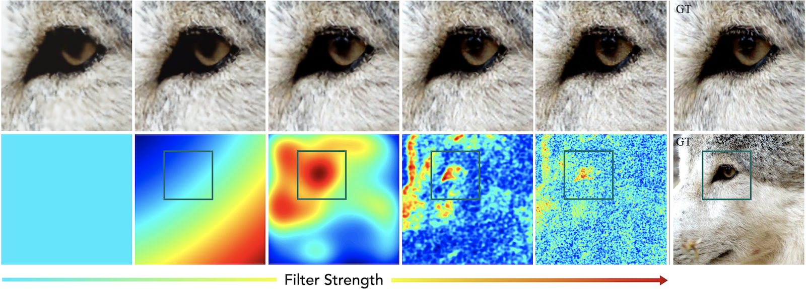

# A Simple And Effective Filtering Scheme For Improving Neural Fields

This repository contains the code for the paper "[A Simple And Effective Filtering Scheme For Improving Neural Fields](https://yixin26.github.io/projects/FINN/FINN.pdf)".




## Install

The code has been tested on Ubuntu 18.04, please follow the following instructions to install the requirements.

```bash
  conda create --name finn python=3.7
  conda activate finn
  conda install  pytorch==1.4.0 cudatoolkit=10.2 torchvision -c pytorch
  pip install -r requirements.txt
```

## Regress images
- Run the following command: `python image_regress.py -g 0 --data './data' --model FINN` to regress all images located at folder `data` using the network `FINN` on gpu `0`.
- To fit a single image, use the following command: `python image_regress.py -g 0 --data './data/reference_1.png' --model FINN` instead.
- For an alternative network, e.g., `FFN`, use the command: `python image_regress.py -g 0 --data './data/reference_1.png' --model FFN`.
- Generate an image with arbitary resolution, e.g., `1000`, run `python image_regress.py --ckpt pretrained_checkpoint_path --test_file save_to_file --model FINN -g 3 --res 1000`.

### Statistics for images
- Run the following command: `python statistics_images.py` for PSNR statistics.
- For the ꟻLIP metric, please use the code from [NVIDIA](https://research.nvidia.com/publication/2020-07_FLIP)


## Reconstruct 3D Surface from point cloud
- Run the following command: `python surface_reconstruct.py --data './test.xyz' --pc_num 100000 --model FINN -g 0` to train the point cloud using the network `FINN`. At each iteration, `100000` points are randomly sampled. 
- Generate a mesh from the signed distance field with an arbitrary resolution, e.g., `1600`, run `python surface_reconstruct.py --ckpt pretrained_checkpoint_path --test_file save_to_file  --model FINN -g 3 --res 1600`.

- Run the following command: `python calc_error_abc.py --gt './shapename.obj' --pred './logs/shapename_FINN/mesh/10000.ply'` to compute reconstruction error indicated by the chamfer distance.


## Novel view synthesis
- We use a simplified version of NeRF for demonstration. We replace the 'Positional Encodering' with 'Gaussian Random Fourier Feature Mapping' and apply 'Filtering' to MLPs. The source code is at file folder `./tiny-nerf`.
- Run the following command: `python run_nerf.py --config ./configs/fern.txt -g 0` to train on 'Fern' dataset. The testing PSNR will be saved.


### Datasets

- Download the datasets for image regression and 3D reconstruction from [google drive](https://drive.google.com/file/d/18Sn6KNOqGx_ACoit8idy2gnP0KSycobn/view?usp=sharing).
- Download the datasets, following the instruction of [nerf-pytorch](https://github.com/yenchenlin/nerf-pytorch/).


## Cite

Please cite our work if you find it useful:

```
@article{zhuang2023finn,
  title={A Simple And Effective Filtering Scheme For Improving Neural Fields},
  author={Zhuang, Yixin},
  journal={Computational Visual Media},
  year={2024}
}
```
