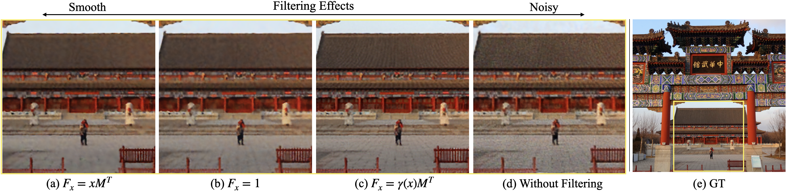

# Filtering In Implicit Neural Network

This repository contains the code for the paper "[Filtering In Implicit Neural Network](https://arxiv.org/abs/2201.13013)".




## Install

The code has been tested on Ubuntu 18.04, please follow the following instructions to install the requirements.

```bash
  conda create --name finn python=3.7
  conda activate finn
  conda install  pytorch==1.4.0 cudatoolkit=10.2 torchvision -c pytorch
  pip install -r requirements.txt
```

## Regress images
- Run the following command: `python image_regress.py -g 0 --data './data' --model FINN` to regress all images located at folder `data` on gpu `0`, using the network `FINN`.
- To fit single image, use the following command: `python image_regress.py -g 0 --data './data/test.png' --model FINN`.
- Switch to another network, e.g., `FFN`, use the following command: `python image_regress.py -g 0 --data './data/test.png' --model FFN` instead.


## Statistics
- Run the following command: `python statistics.py` for PSNR statistics.
- For ꟻLIP metric, please use the code from [NVIDIA](https://research.nvidia.com/publication/2020-07_FLIP)


## Cite

Please cite our work if you find it useful:

```
@article{zhuang2022finn,
  title={Filtering In Implicit Neural Network},
  author={Zhuang, Yixin},
  journal={arXiv 2201.13013},
  year={2022}
}
```
