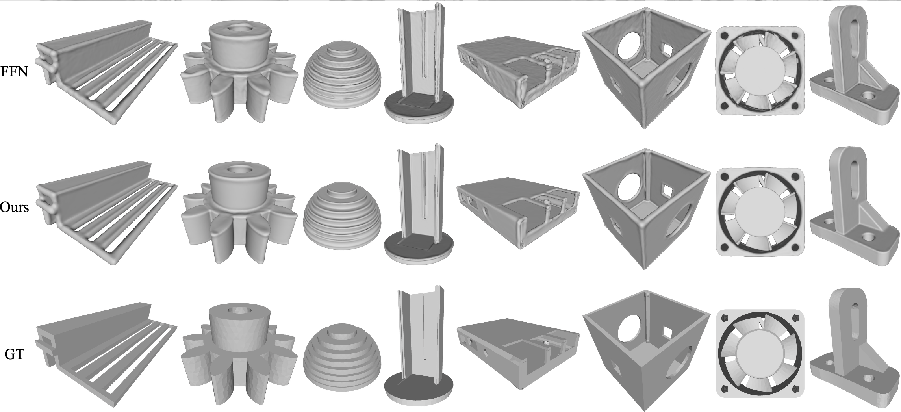

# Filtering In Neural Implicit Functions

This repository contains the code for the paper "[Filtering In Neural Implicit Functions](https://arxiv.org/abs/2201.13013)".


## Install

The code has been tested on Ubuntu 18.04, please follow the following instructions to install the requirements.

```bash
  conda create --name finn python=3.7
  conda activate finn
  conda install  pytorch==1.4.0 cudatoolkit=10.2 torchvision -c pytorch
  pip install -r requirements.txt
```

## Regress images
- Run the following command: `python image_regress.py -g 0 --data './data' --model FINN` to regress all images located at folder `data` using the network `FINN` on gpu `0`.
- To fit a single image, use the following command: `python image_regress.py -g 0 --data './data/test.png' --model FINN` instead.
- For an alternative network, e.g., `FFN`, use the command: `python image_regress.py -g 0 --data './data/test.png' --model FFN`.
- Generate an image with arbitary resolution, e.g., `1000`, run `python image_regress.py --ckpt pretrained_checkpoint_path --test_file save_to_file --model FINN -g 3 --res 1000`.

### Statistics
- Run the following command: `python statistics.py` for PSNR statistics.
- For the ꟻLIP metric, please use the code from [NVIDIA](https://research.nvidia.com/publication/2020-07_FLIP)



## Reconstruct 3D Surface from point cloud
- Run the following command: `python surface_reconstruct.py --data './test.xyz' --pc_num 100000 --model FINN -g 0` to train the point cloud using the network `FINN`. At each iteration, `100000` points are randomly sampled. 
- Generate a mesh from the signed distance field with an arbitrary resolution, e.g., `1600`, run `python surface_reconstruct.py --ckpt pretrained_checkpoint_path --test_file save_to_file  --model FINN -g 3 --res 1600`.

## Cite

Please cite our work if you find it useful:

```
@article{zhuang2022finn,
  title={Filtering In Neural Implicit Functions},
  author={Zhuang, Yixin},
  journal={arXiv 2201.13013},
  year={2022}
}
```
